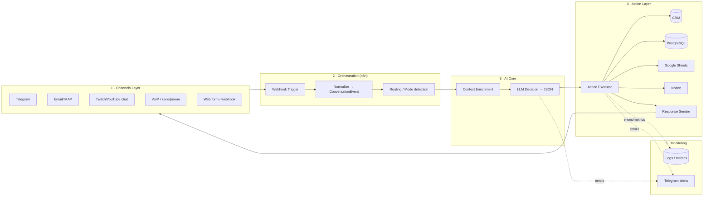
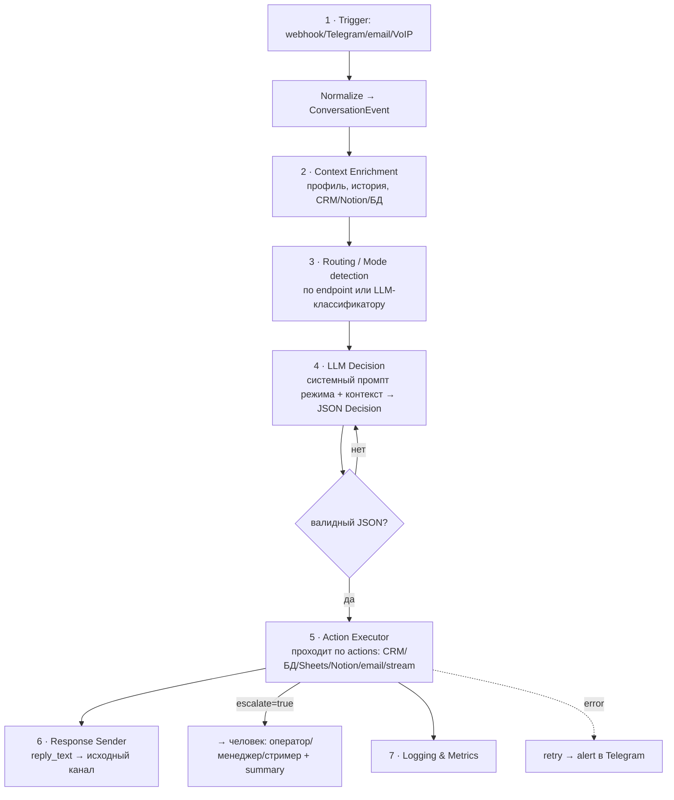

# AI Automation Hub — Blueprint (скелет проекта)

> Один модульный AI-проект, из которого собираются 6 продуктов сменой конфигурации, а не переписыванием кода:
> **колл-центр · ИИ-друг · ИИ-ассистент · воронка продаж · помощник стримера · документооборот из почты в БД.**

Версия: 0.1 · Назначение: основной core-проект портфолио (AI Automation / Junior–Mid Backend / Workflow Engineer).

---

## 0. TL;DR

Все шесть сценариев — это **одна и та же архитектура**:

```
Получить событие → Обогатить контекстом → Понять режим → Решить (LLM) → Выполнить действия → Ответить → Залогировать
```

Поэтому строим **не 6 проектов, а 1 ядро + 6 конфигов**. Меняется только: системный промпт режима, набор разрешённых `actions`, подключённые интеграции. Код ядра и протокол данных — общие.

Главная ценность для работодателя: проект демонстрирует backend, БД, Docker, интеграции, AI и **архитектурное мышление** (контракты данных, обработка ошибок, мониторинг) — а не «ещё один бот».

---

## 1. Принцип «один скелет → много продуктов»

Ключевая идея — **жёсткие контракты на границах**. Что бы ни пришло (Telegram, почта, чат стрима, звонок), оно превращается в единый объект `ConversationEvent`. Что бы LLM ни решил — он обязан вернуть единый объект `Decision` (`reply_text` + `actions[]` + `escalate`). Между этими двумя контрактами живёт переиспользуемое ядро.

Новый продукт = новый файл режима (`mode`), а не новый сервис:

```
mode = CALL_CENTER | FRIEND | ASSISTANT | SALES_FUNNEL | STREAM_HELPER | DOCS_AUTOMATION
```

---

## 2. Архитектура (5 слоёв)



| Слой | Ответственность | Технологии |
|------|-----------------|------------|
| **1. Channels** | Приём из любого канала, приведение к `ConversationEvent` | Telegram Bot API, IMAP/Gmail API, Twitch/YouTube chat API, VoIP API, web webhook |
| **2. Orchestration** | Маршрутизация по режиму, вызов сервисов | n8n (self-hosted, Docker) |
| **3. AI Core** | Обогащение контекстом + решение | FastAPI (gateway/санитайзер) + LLM API (Claude / GPT / Perplexity через OpenRouter), Ollama (fallback/local) |
| **4. Action Layer** | Выполнение действий и ответ в канал | PostgreSQL, Google Sheets, Notion, CRM, e-mail, стрим-API |
| **5. Monitoring** | Логи, метрики, алерты | PostgreSQL / Sheets + Telegram alerts |

> **Почему FastAPI рядом с n8n:** n8n — оркестрация и интеграции (zero-code), FastAPI — то, что неудобно в n8n: санитайзер PII, валидация схем, fallback между LLM, тяжёлая логика. Это разделение ответственности и есть «архитектурная зрелость».

---

## 3. Контракты данных (точка переиспользования)

### 3.1 `ConversationEvent` — вход (нормализованный)

```json
{
  "$schema": "conversation_event.v1",
  "event_id": "uuid",
  "received_at": "2026-06-06T12:00:00Z",
  "channel": "telegram | email | twitch | youtube | voip | webform",
  "mode_hint": "SALES_FUNNEL | null",
  "user": {
    "user_id": "external-or-internal-id",
    "display_name": "string|null",
    "locale": "ru|en|null"
  },
  "message": {
    "type": "text | voice | file | event",
    "text": "string|null",
    "attachments": [{ "kind": "pdf|image|audio", "url": "string", "mime": "string" }]
  },
  "metadata": { "raw_channel_id": "string", "thread_id": "string|null", "extra": {} }
}
```

### 3.2 `Decision` — выход LLM (строгий JSON, всегда одинаковый)

```json
{
  "$schema": "decision.v1",
  "reply_text": "string|null",
  "escalate": false,
  "confidence": 0.0,
  "actions": [
    {
      "type": "create_ticket | update_lead_stage | save_record | send_email | upsert_note | create_clip | set_reminder | none",
      "params": {},
      "idempotency_key": "string"
    }
  ],
  "log": { "intent": "string", "summary": "string" }
}
```

> LLM **обязан** возвращать валидный JSON по этой схеме (JSON Mode / Function Calling). FastAPI валидирует через Pydantic; невалидный ответ → retry с уточнённым промптом, при повторе → `escalate=true`.

### 3.3 Реестр действий (`action types`)

Каждый `type` имеет фиксированную схему `params` и **уровень доверия**. Это позволяет давать ИИ права прогрессивно (см. §7): `read` → `draft` → `prod`.

| action | params | уровень |
|--------|--------|---------|
| `create_ticket` | `{title, body, priority, contact}` | prod |
| `update_lead_stage` | `{lead_id, stage, note}` | prod |
| `save_record` | `{table, fields{}}` | prod |
| `send_email` | `{to, subject, body, as_draft}` | draft→prod |
| `upsert_note` | `{user_id, text, tags[]}` | draft |
| `create_clip` | `{stream_id, timestamp, title}` | prod |
| `set_reminder` | `{user_id, when, text}` | draft |
| `none` | `{}` | read |

---

## 4. Универсальный workflow (скелет n8n)

Один и тот же граф для всех режимов:



Шаги по сути: **Trigger → Enrich → Route → Decide → Execute → Respond → Log**. Везде одинаково; различается только содержимое шага 4 (промпт режима) и допустимые действия в шаге 5.

---

## 5. Конфигурация режима

Один режим описывается небольшим конфигом + системным промптом:

```yaml
# modes/sales_funnel.yaml
mode: SALES_FUNNEL
tone: "профессиональный, проактивный"
system_prompt_file: prompts/sales_funnel.md
allowed_actions: [update_lead_stage, save_record, send_email, set_reminder]
trust_level: draft        # read | draft | prod
integrations: [crm, postgres, email]
escalate_when: ["цена/контракт", "жалоба", "запрос на человека"]
```

Чтобы получить новый продукт, меняешь **только**: `system_prompt`, `allowed_actions`, `integrations`, правила эскалации. Ядро не трогаешь.

---

## 6. Шесть продуктов из одного скелета

| Продукт | mode | Тон / фокус | Ключевые actions | Интеграции | Эскалация |
|---------|------|-------------|------------------|------------|-----------|
| **Колл-центр ИИ** | `CALL_CENTER` | формальный, первая линия | `create_ticket`, `save_record` | CRM, телефония/TTS, Postgres | сложный кейс, негатив, NPS-риск |
| **ИИ-друг** | `FRIEND` | тёплый, долгая память | `upsert_note`, `set_reminder` | Postgres (память) | признаки кризиса → человек/ресурсы |
| **ИИ-ассистент** | `ASSISTANT` | деловой, задачи | `set_reminder`, `save_record`, `upsert_note` | Notion, Sheets, Calendar | — |
| **Воронка продаж** | `SALES_FUNNEL` | проактивный | `update_lead_stage`, `send_email`, `set_reminder` | CRM, email | цена/договор → менеджер |
| **Помощник стримера** | `STREAM_HELPER` | живой, модерация | `create_clip`, `upsert_note`, `none` | Twitch/YouTube API | спонсор/донат-инцидент |
| **Документы из почты → БД** | `DOCS_AUTOMATION` | строгий, извлечение полей | `save_record`, `create_ticket` | IMAP/Gmail, Postgres, Notion | низкая `confidence` парсинга |

Один граф, одни контракты — шесть демо.

---

## 7. Безопасность и масштабирование (по умолчанию на 10k+ пользователей)

- **Секреты:** только в `.env` / n8n credentials / секрет-стор; `.env.example` в репо, реальные значения — никогда. PII режется санитайзером в FastAPI **до** отправки в LLM.
- **Прогрессивный уровень доверия:** новый режим стартует в `read`/`draft` (ИИ только предлагает черновики), переход в `prod` — осознанно. Защищает от автономных ошибочных действий.
- **Идемпотентность:** у каждого действия `idempotency_key` → повторный вебхук не создаёт дубль тикета/письма.
- **Очереди и backpressure:** при росте нагрузки тяжёлые задачи — в очередь (n8n queue mode / Redis), а не синхронно. Webhook отвечает быстро, обработка асинхронно.
- **Rate limits & retry:** экспоненциальный retry на внешних API, бюджет токенов на пользователя/режим, fallback на локальный Ollama при недоступности облака.
- **Наблюдаемость:** каждый запрос/ответ/действие/ошибка логируется (latency, успех/ошибка, режим). Алерты в Telegram на сбои LLM/API/таймауты.
- **Изоляция:** весь стек в `docker-compose`, n8n за reverse-proxy (Caddy/Nginx) + HTTPS, БД и n8n не торчат наружу голыми портами.

---

## 8. Стек

```
n8n (self-hosted, Docker)      — оркестрация и интеграции
FastAPI (Python 3.11+)         — gateway, санитайзер PII, валидация Pydantic, LLM fallback
PostgreSQL                     — память, лиды, тикеты, логи, метрики
LLM API (Claude / GPT / Perplexity via OpenRouter) + Ollama (local fallback)
Каналы: Telegram / Gmail-IMAP / Twitch-YouTube / VoIP / webform
Docker Compose + Caddy/Nginx + Let's Encrypt  — деплой на VPS
GitHub (код + JSON workflows) + Loom/YouTube (демо)
```

---

## 9. Структура репозитория

```
ai-automation-hub/
├── README.md                  # лицо проекта: проблема, архитектура (Mermaid), демо-ссылки, бизнес-ценность
├── docker-compose.yml         # fastapi + n8n + postgres + caddy, запуск одной командой
├── .env.example
├── gateway/                   # FastAPI: санитайзер, валидация Decision, роутинг к LLM, fallback
│   ├── app/ (routes, schemas, services)
│   └── tests/
├── workflows/                 # экспортированные JSONن8n по режимам
│   ├── _core.json             # универсальный скелет
│   ├── call_center.json
│   ├── sales_funnel.json
│   └── docs_automation.json
├── prompts/                   # системные промпты по режимам
│   ├── call_center.md
│   ├── friend.md
│   └── sales_funnel.md
├── modes/                     # конфиги режимов (yaml: tone, allowed_actions, trust_level)
├── schemas/                   # conversation_event.v1.json, decision.v1.json
└── docs/
    ├── architecture.md        # слои + диаграммы
    └── protocol.md            # ConversationEvent / Decision / action registry
```

---

## 10. Roadmap (4 недели до упакованного портфолио)

**Неделя 1 — фундамент.** VPS + безопасность, `docker-compose` (FastAPI + n8n + Postgres + Caddy/HTTPS). Сквозной тест: webhook → FastAPI → n8n → запись в Postgres. *Готово = сервер по HTTPS со сквозным логом.*

**Неделя 2 — ядро и контракты.** FastAPI: Pydantic-схемы `ConversationEvent`/`Decision`, санитайзер PII, клиент LLM с fallback на Ollama. Универсальный `_core.json` в n8n (Trigger→Enrich→Route→Decide→Execute→Respond→Log). *Готово = ядро принимает событие и возвращает валидный Decision.*

**Неделя 3 — 1-й флагманский режим.** Выбрать один продукт (рекоменд.: `DOCS_AUTOMATION` или `SALES_FUNNEL`), довести end-to-end с реальной интеграцией + эскалацией. *Готово = рабочий сценарий + 2-мин демо-видео.*

**Неделя 4 — 2-й режим + упаковка.** Второй режим как доказательство переиспользования (меняется только конфиг). README с Mermaid и блоком «бизнес-ценность», 2–3 демо, архивация старых репо. *Готово = один безупречный репозиторий, готовый к рассылке.*

**Later (месяц 2+):** остальные режимы (friend / assistant / stream_helper) как модули, оптимизация токенов (Ollama в prod), активный отклик на вакансии с живым демо.

---

## 11. Что показать в портфолио

- **1 репозиторий** `ai-automation-hub`: ядро + `workflows/` (несколько режимов) + `prompts/` + `schemas/` + `docs/`.
- **README** как спецификация продукта: проблема → архитектурная Mermaid-схема → бизнес-ценность («один движок — 6 продуктов, новый сценарий за конфиг, а не за месяц») → ссылки на демо.
- **2–3 демо-видео:** (1) обзор архитектуры и универсального флоу; (2) колл-центр/продажи; (3) документооборот или стример.

Месседж рекрутёру/тимлиду: *«Спроектировал и развернул self-hosted платформу AI-автоматизации с едиными контрактами данных; из одного ядра конфигом собираются разные продукты — пример оркестрации, работы с Docker и обработки ошибок в репозитории».*

---

## 12. Следующие шаги (на выбор)

1. Сгенерировать рабочие JSON-схемы `conversation_event.v1.json` и `decision.v1.json` + Pydantic-модели — чтобы сразу завести в n8n/FastAPI.
2. Написать `docker-compose.yml` + `.env.example` (скелет недели 1).
3. Написать `README.md` репозитория по этому blueprint.
4. Расписать системный промпт одного режима (например, `docs_automation.md`).
