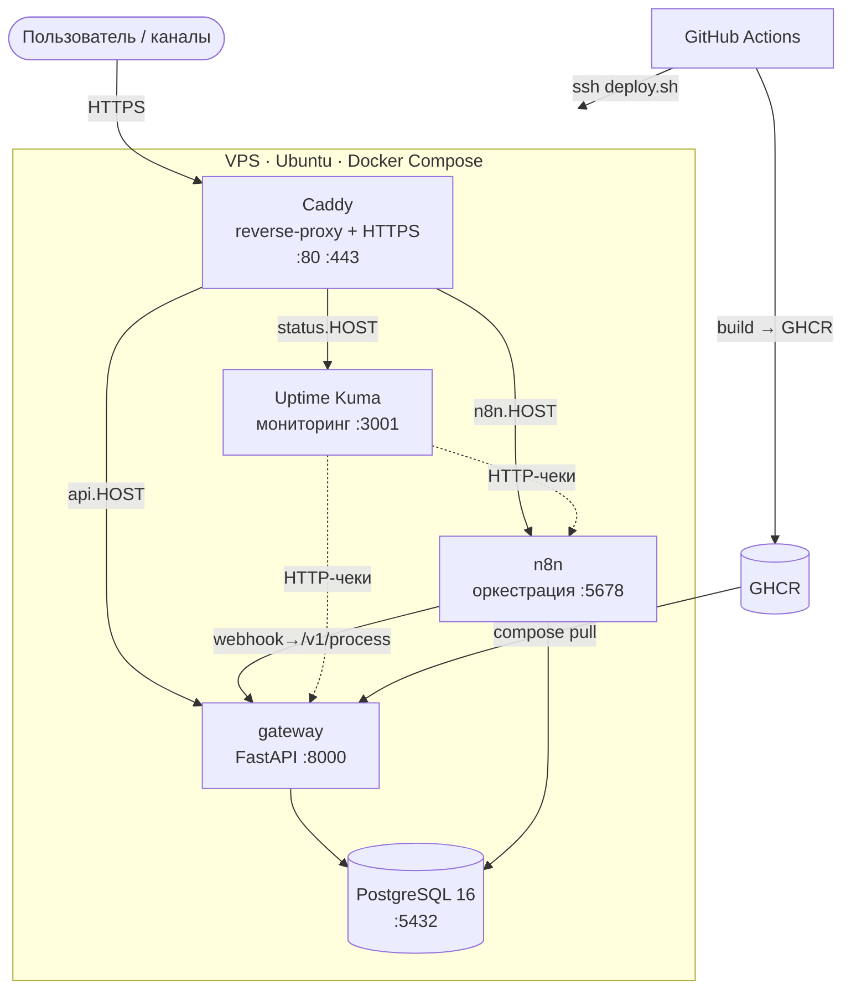

# AI Automation Hub — Core

Запускаемое модульное ядро AI-автоматизации: **один engine, к которому режимы (support / sales / docs / friend / stream) прилепляются как дополнения — без переписывания кода.** Каркас стоит на жёстких контрактах данных и переключаемых LLM-провайдерах.

> Полное описание архитектуры и план развития — в [`AI-Automation-Hub-Blueprint.md`](./AI-Automation-Hub-Blueprint.md).

## Что это показывает работодателю

Проект собран так, чтобы закрывать требования позиций **AI Automation Engineer · Junior Backend · Automation Developer · AI Workflow Engineer · Junior Platform / DevOps-oriented Developer**: контейнеризация (Docker Compose), backend на FastAPI, PostgreSQL, оркестрация n8n, интеграция LLM, обработка ошибок и наблюдаемость.

## Архитектура (поток)

```
Канал → n8n (webhook, normalize) → Gateway /v1/process:
   voice→Whisper → санитайзер PII → LLM(JSON) → валидация Decision (retry+fallback)
   → idempotency_key → лог в Postgres → Decision обратно в n8n → ответ/эскалация в канал
```

Слои: **Channels → Orchestration (n8n) → AI Core (FastAPI + LLM) → Actions → Monitoring**.

## Контракты (точка расширения)

- `schemas/conversation_event.v1.json` — единый вход из любого канала.
- `schemas/decision.v1.json` — строгий выход LLM (`reply_text` + `actions[]` + `escalate`).

Новый режим = новый `mode_hint` + системный промпт + список разрешённых `actions`. Ядро не трогаем.

## Быстрый старт

```bash
cp .env.example .env          # заполни секреты и выбери LLM_PROVIDER
docker compose up -d --build
```

- n8n UI: `https://<N8N_HOST>/` → импортируй `workflows/_core.json`
- Gateway health: `GET /health`
- Прод: задай реальные домены в `.env` (`N8N_HOST`, `GATEWAY_HOST`) — Caddy сам выпустит HTTPS.

### Проверка ядра вручную

```bash
curl -X POST https://<GATEWAY_HOST>:8443/v1/process \
  -H "X-API-Key: $GATEWAY_API_KEY" -H "Content-Type: application/json" \
  -d '{"channel":"webform","mode_hint":"support",
       "user":{"user_id":"u1"},"message":{"type":"text","text":"Привет"}}'
```

## LLM-провайдеры (переключаются в `.env`)

| Переменная | Значения |
|------------|----------|
| `LLM_PROVIDER` | `stub` (demo без ключей) · `ollama` (локально) · `openrouter` (облако) |
| `LLM_FALLBACK_PROVIDER` | пусто или второй провайдер |
| `TRANSCRIBE_PROVIDER` | `none` · `whisper_local` · `openai_whisper` |

Добавить нового провайдера: класс в `gateway/app/providers/` + ветка в `factory.py`. Роуты и engine не меняются.

## Стек

`FastAPI · Pydantic v2 · PostgreSQL (asyncpg) · n8n · Docker Compose · Caddy/HTTPS · Ollama/OpenRouter/Whisper`

## Тесты

```bash
cd gateway && pip install -r requirements.txt pytest pytest-asyncio
PYTHONPATH=. pytest -q
```

## Структура

```
docker-compose.yml · Caddyfile · .env.example
gateway/            FastAPI: config, schemas, sanitizer, providers/, engine, db, main, tests
schemas/            JSON-контракты v1
workflows/          _core.json — базовый n8n-граф без режимов
AI-Automation-Hub-Blueprint.md   полный blueprint
```

## Безопасность / масштаб (по умолчанию)

API-ключ на gateway, PII режется до LLM, идемпотентность действий, прогрессивный trust-level (`read→draft→prod`), мягкая деградация при недоступности БД, изоляция сервисов за reverse-proxy. Под нагрузку — n8n queue mode + воркеры gateway.

---

## Флагманский режим: Support / Sales Triage

Первый production-подобный вертикал поверх ядра. Входящее сообщение → классификация (support/sales/billing/spam) → строгий `Decision` (JSON) → черновик ответа + действия (тикет / draft-письмо / follow-up) → эскалация на человека при негативе/запросе оператора → лог в Postgres.

**Бизнес-ценность.** Автоматизирует первую линию поддержки и квалификацию лидов: сокращает время первичной обработки обращения с минут до секунд, снимает рутину с людей, а спорные кейсы безопасно эскалирует. Демонстрирует ровно то, за что платят на ролях AI Automation / Backend: интеграция LLM, структурированные выходы, ветвление, обработка ошибок, БД, Docker.

**Где живёт режим.** `modes/support_triage.json` (разрешённые действия, trust_level, правила эскалации) + `prompts/support_triage.md` (системный промпт). Новый продукт = новые два файла, код ядра не меняется.

**Trust-level (прогрессивное доверие).** На `draft` ядро автономно выполняет только обратимые/внутренние действия (тикет, draft-письмо, напоминание); необратимые внешние (`update_lead_stage`, `create_clip`) — только на `prod`. Если LLM предложил неразрешённое действие — оно отбрасывается и кейс эскалируется.

### Demo без ключей

`LLM_PROVIDER=stub` (по умолчанию) — rule-based провайдер, ядро работает сразу после `docker compose up`, без LLM-кредов. Идеально для демо-видео.

```bash
cp .env.example .env
docker compose up -d --build
# прогнать демо-сценарии (support / sales / жалоба / billing):
GATEWAY=http://localhost:8000 API_KEY=change_me_shared_secret ./scripts/demo.sh
```

В проде меняешь один параметр — `LLM_PROVIDER=ollama` или `openrouter` — поведение и контракты те же.

### CI

`.github/workflows/ci.yml` гоняет `ruff` (lint) + `pytest` на каждый push и валидирует `docker-compose`. Зелёный билд = сигнал зрелости для тимлида. `.github/workflows/deploy.yml` после зелёного CI собирает образ gateway, пушит в GitHub Container Registry и деплоит на VPS по SSH.

---

## Production-деплой (VPS)

Прод-стек вынесен в отдельный самодостаточный файл `docker-compose.prod.yml` (dev-`docker-compose.yml` не трогается). Отличия прода: пиннинг версий образов, resource-лимиты под 4 ГБ RAM, healthcheck'и у всех сервисов, ротация логов, сервисы наружу не торчат (только Caddy 80/443), gateway тянется образом из GHCR, добавлен мониторинг Uptime Kuma.

### Архитектура прода



### Фазы деплоя

1. **Сервер.** В панели Hetzner — rebuild на Ubuntu 24.04 LTS. Затем от root:

   ```bash
   bash deploy/hardening.sh <username> "<твой-ssh-public-key>"
   ```

   Скрипт создаёт sudo-пользователя, отключает root/пароли по SSH, ставит ufw (22/80/443), fail2ban, авто-обновления, 2 ГБ swap и Docker. **Проверь вход новым пользователем в отдельном окне, прежде чем закрыть root-сессию.**

2. **Код на сервер.** От нового пользователя:

   ```bash
   git clone <repo-url> n8n-automation && cd n8n-automation
   cp .env.example .env
   ```

3. **Заполни `.env`** (прод-значения):
   - домены: `N8N_HOST=n8n.<IP>.sslip.io`, `GATEWAY_HOST=api.<IP>.sslip.io`, `STATUS_HOST=status.<IP>.sslip.io`, `ACME_EMAIL=...`;
   - сильный `POSTGRES_PASSWORD`; `N8N_ENCRYPTION_KEY=$(openssl rand -hex 24)`;
   - `N8N_BASIC_AUTH_ACTIVE=true` + логин/пароль; смени `GATEWAY_API_KEY`.

4. **Запуск:**

   ```bash
   ./deploy/deploy.sh          # или: make prod-up
   docker compose -f docker-compose.prod.yml ps
   ```

   Caddy сам выпустит HTTPS-сертификаты. Проверь: `https://n8n.<IP>.sslip.io`, `https://status.<IP>.sslip.io`.

5. **Бэкапы.** Разовый — `./deploy/backup.sh`. Ежедневный — в cron:

   ```cron
   30 3 * * * cd /home/<user>/n8n-automation && ./deploy/backup.sh >> /var/log/hub-backup.log 2>&1
   ```

6. **CI/CD.** Заведи GitHub Secrets (`SSH_HOST`, `SSH_USER`, `SSH_PRIVATE_KEY`, `SSH_PORT`, `DEPLOY_PATH`). Дальше push в `main` → авто-сборка → деплой.

### Восстановление из бэкапа

```bash
gunzip -c backups/postgres/hub-XXXX.sql.gz | \
  docker compose -f docker-compose.prod.yml exec -T postgres psql -U "$POSTGRES_USER" -d "$POSTGRES_DB"
```

### Переезд на свой домен

Купить домен (Cloudflare/Namecheap) → A-запись `*.домен` или три записи (`n8n`, `api`, `status`) на IP VPS → поменять `*_HOST` в `.env` → `make prod-up`. Код не меняется.

### Бюджет RAM (CX, 4 ГБ)

| Сервис | Лимит | Резерв |
|--------|------|--------|
| n8n | 1.2 G | 512 M |
| postgres | 1.0 G | 512 M |
| gateway | 512 M | 256 M |
| uptime-kuma | 256 M | — |
| caddy | 128 M | — |

≈ 3.1 ГБ лимитов + система; 2 ГБ swap — страховка от пиков. Под рост (боты/нагрузка) — апгрейд тарифа или вынос Postgres на отдельный инстанс.
